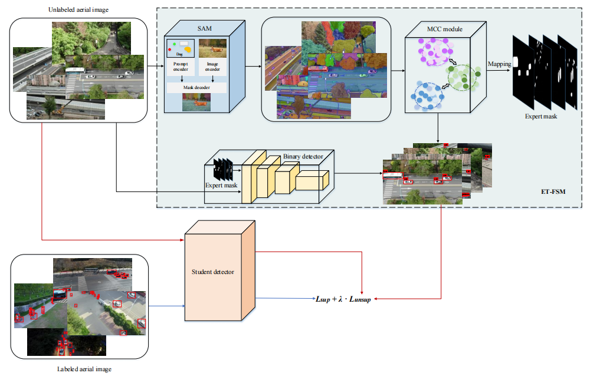
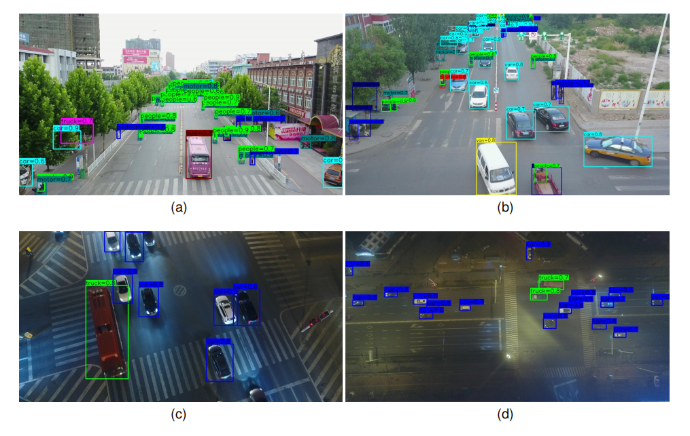

# ET-FSM
Codes for ***Expert Teacher Based on Foundation Image Segmentation Model for Object Detection in Aerial Images***

Yinhui Yu,Xu Sun,Qing Cheng


## Update
- [2023/8] This code will be released soon.


### ⚙ Network Architecture




## 🌐 Usage

**1. Virtual Environment**
```
conda env create -f environment.yml
```

**2. Data Preparation**

The unsupervised drone images we collected will soon be provided with a download link to Google Cloud Drive.


**3. ET-FSM Training**

Run 
```
source ~/.bashrc
conda activate ET-FSM
which python
nohup python3  {config_path}\
    --work-dir  {checkpoint_path}\
    --gpu-ids 0 > {log_path}.log 2>&1 &
``` 
and the trained model is available in ``'./checkpoints/'``.


**4 ET-FSM Testing**

Run 
```
source ~/.bashrc
conda activate ET-FSM
which python
python3  {config_path}\
    --work-dir  {checkpoint_path}\
    --eval bbox \
    --gpu-ids 0
``` 


**5 The visualizing detection results of our approach on the Visdrone and UAVDT datasets.**


